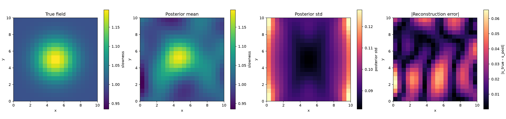

# Bayesian Linear Travel-Time Tomography

A small, reproducible computational study of a finite-dimensional Bayesian linear
inverse problem motivated by crosshole seismic travel-time tomography. The
slowness field is discretized on a uniform grid, travel times are modeled as
straight-ray line integrals, and the resulting linear-Gaussian posterior is
computed in closed form (no MCMC, no iterative optimization).

The full scientific specification — problem statement, prior/likelihood model,
and the four experiments (construction/validation, correctly-specified
Bayesian calibration, fixed-truth coverage under a well-matched and a
mismatched truth, and a predetermined acquisition-geometry comparison) — is in
`experiment.pdf`.

**Headline result:** under the correctly specified generative model
(Experiment II), the posterior is exactly calibrated — `Q ~ chi2(n_cells)`, confirmed
empirically. Under a fixed physical truth (Experiment III), that guarantee no
longer holds: a smooth truth well matched to the prior's assumed smoothness
remains well calibrated (in fact conservatively over-covers), while a sharp,
prior-mismatched truth produces severe undercoverage — despite an identically
well-defined posterior in both cases. This distinction, between a posterior
being mathematically well defined and a posterior being a trustworthy
description of physical uncertainty, is the project's central finding.

**Key results:**

- The posterior is available in exact closed form — no MCMC, no iterative
  optimization — via Cholesky factorizations and triangular solves throughout.
- Under the correctly specified generative model, `Q ~ chi2(n_cells)` is
  confirmed empirically over 1000 independent realizations.
- The fixed-truth smooth/sharp comparison shows how prior-truth compatibility
  governs coverage, with an identically well-defined posterior in both cases.
- The analytical `E[Q]` decomposition identifies deterministic bias — not
  observation noise — as the mechanism behind the sharp truth's inflated `Q`.
- Experiment IV evaluates the effect of predetermined acquisition geometry on
  Bayesian reconstruction. Uniform, mildly boundary-clustered, and strongly
  boundary-clustered source/receiver layouts are compared at fixed grid
  resolution, ray count, prior, truth, and noise level. Posterior covariance
  metrics are paired with repeated-noise reconstruction experiments, including
  an independent-seed robustness check.

## Model

Domain `Omega = [0, W]^2`, sources on `x=0`, receivers on `x=W`, straight rays
connecting every source to every receiver. Slowness `s = 1/v` is discretized
on an `n x n` grid (`p = n**2` unknown cells), giving the linear forward model
`t = A s`, with `A_ij` the exact length of ray `i` through cell `j`. Synthetic
data are `d = A s_true + epsilon`, `epsilon ~ N(0, Sigma_d)` (`Sigma_d =
sigma^2 I` throughout this project). The prior is `s ~ N(s0, Cs)`, with
constant background mean and a squared-exponential covariance. The exact
Gaussian posterior,

```
C_post = (A^T Sigma_d^-1 A + Cs^-1)^-1
s_post = C_post (A^T Sigma_d^-1 d + Cs^-1 s0)
```

is computed via Cholesky factorizations and triangular solves throughout —
never an explicit matrix inverse (see `inversion.py`).

See `experiment.pdf` for the full mathematical derivation, `ARCHITECTURE.md`
for the module dependency structure and implementation-level diagnostics
(including why Experiment III's per-cell `z`/KS diagnostics don't resemble
Experiment II's even for a well-matched truth, and the follow-up investigation
into a boundary/interior coverage effect observed in Experiment III), and
`CLAUDE.md` for the module contracts and conventions used throughout the
implementation.

## Status

Complete. The project implements and validates Experiment I
(construction/validation), Experiment II (correctly specified Bayesian
calibration), Experiment III (fixed-truth coverage, both a smooth and a
sharp truth), and Experiment IV (predetermined acquisition-geometry
comparison), plus a follow-up diagnostic investigation into an observed
coverage effect in Experiment III (see `ARCHITECTURE.md`). The package
(`geometry.py`, `forward.py`, `prior.py`, `inversion.py`, `diagnostics.py`,
`experiments.py`, `plots.py`, `config.py`) and its test suite are fully
implemented.

Reproduce each experiment with:

```bash
# Experiment I: construction and validation
scripts/run_experiment.py configs/baseline.yaml --plot

# Experiment II: correctly specified Bayesian calibration
scripts/run_experiment.py configs/calibration_correct.yaml --experiment correctly_specified

# Experiment III: fixed-truth coverage (smooth or sharp)
scripts/run_experiment.py configs/calibration_fixed_truth.yaml --experiment fixed_truth_smooth
scripts/run_experiment.py configs/calibration_fixed_truth.yaml --experiment fixed_truth_sharp

# Experiment IV: predetermined acquisition-geometry comparison
scripts/run_experiment_iv.py configs/experiment_iv.yaml --plot
```

The `n=20`, `N=1000`, `seed=12345` run under `results/baselines/` (files
`experiment_II_baseline_n20_N1000_seed12345.{npz,yaml}`) is the validated,
frozen reference result for Experiment II. It should not be overwritten by a
run with a different seed or configuration without also updating this note.

Likewise, `experiment_III_baseline_smooth_n20_N1000_seed12345.npz` and
`experiment_III_baseline_sharp_n20_N1000_seed12345.npz` under
`results/baselines/` (sharing config
`experiment_III_baseline_config_n20_N1000_seed12345.yaml`, identical to
`configs/calibration_fixed_truth.yaml`) are the validated, frozen reference
results for Experiment III's smooth-vs-sharp fixed-truth comparison. They
should not be overwritten by a run with a different seed, truth, or
configuration without also updating this note.

Likewise, `experiment_IV_baseline_n20_Ns16Nr16_10seeds_200reps.npz` under
`results/baselines/` (config
`experiment_IV_baseline_config_n20_Ns16Nr16_10seeds_200reps.yaml`, identical
to `configs/experiment_iv.yaml`) is the validated, frozen reference result for
Experiment IV's 10-master-seed x 200-repeat protocol (2000 paired
realizations total). Note this uses a different acquisition than Experiment
III's frozen baselines — `Ns = Nr = 16` (`m = 256` rays) here, versus
`Ns = Nr = 12` (`m = 144` rays) for Experiment III — so Experiment IV is not a
reproduction of the Experiment III baseline at a different geometry, but a
separate experiment reusing Experiment III's smooth fixed truth. It should not
be overwritten by a run with a different seed, geometry set, or configuration
without also updating this note.

## Scope

This project studies Bayesian uncertainty quantification for a
finite-dimensional, linear-Gaussian travel-time tomography model.

The forward model uses straight-ray travel times through a 2D
piecewise-constant slowness field. A Gaussian squared-exponential prior
and Gaussian observation noise give an analytically tractable posterior,
allowing reconstruction accuracy and uncertainty calibration to be
examined directly.

The experiments progress from forward-model construction and validation,
through calibration under the correctly specified generative model, to
fixed-truth experiments that illustrate the effect of prior–truth
mismatch on posterior uncertainty, and finally to a predetermined
acquisition-geometry comparison (Experiment IV). Experiment IV compares
exactly three predetermined geometries (uniform and two boundary-clustered
layouts) — it is not a systematic acquisition-geometry sweep, and no
optimizer, additional gamma values, or asymmetric layouts are part of it. A
controlled prior-misspecification experiment and a controlled
noise-misspecification experiment are likewise not part of this project. For
more details about the experiments please refer to `experiment.pdf`.

## Figures

Curated final figures live under `figures/` (tracked; regenerate with
`scripts/make_figures.py`, which reads `configs/baseline.yaml` and the frozen
`results/baselines/` outputs and never regenerates those baselines). On-image
text is kept short and purely descriptive; the findings below live in this
README, not baked into the images, so the figures stay reusable elsewhere
with their own captions.

Primary sequence — geometry → forward operator → Experiment I → Experiment II
→ Experiment III → Q decomposition:



1. `figure_1_geometry.png` — domain, sources, receivers, a small deterministic
   sample of rays plus one highlighted ray with the cells it intersects.
2. `figure_2_ray_coverage.png` — per-cell total ray-intersection length. The
   exactly-zero band along the outer top/bottom rows is expected (sources and
   receivers occupy an open subinterval of the boundary, so no ray reaches
   the outermost half-cell strip); the dark-but-nonzero left/right edge
   columns reflect fewer/longer rays there, not zero coverage — verified
   directly from `A`, not assumed.
3. `figure_3_experiment_I_reconstruction.png` (above) — true field / posterior
   mean / posterior standard deviation / absolute reconstruction error. The
   fourth panel is one noisy realization's error, not a systematic spatial
   pattern.
4. `figure_4_experiment_II_calibration.png` — global `Q` vs. `chi2(n_cells)`,
   and credible-region coverage vs. nominal.
5. `figure_5_experiment_III_fixed_truth.png` — smooth vs. sharp truth,
   posterior mean, and posterior standard deviation (six panels). The two
   posterior-std panels are confirmed numerically identical (bit-identical
   `posterior_stds` in the frozen baselines): `C_post` depends only on the
   acquisition geometry, prior, and noise level, never on `s_true`, so the
   posterior's claimed uncertainty is blind to whether the fixed truth
   actually matches the prior.
6. `figure_6_fixed_truth_Q_decomposition.png` — the `E[Q] = tr(C_post^-1
   V_post) + b^T C_post^-1 b` decomposition (components panel) and its
   theoretical-vs-empirical total (right panel), smooth vs. sharp, with
   numeric value labels on every bar (the smooth bias term, ~0.28, would
   otherwise be invisible on a log axis spanning ~10^0 to ~10^7).

**Supplementary diagnostic figure** (not part of the primary result
sequence):

7. `figure_7_boundary_interior_coverage.png` — a follow-up spatial check for
   the sharp truth. Ray density, posterior variance, and bias/noise ratios
   normalized by posterior uncertainty were all checked at `block_size=4`,
   and none explains the boundary/interior coverage gap shown here; the
   effect may arise from higher-order spatial structure not captured by
   these diagnostics (see `ARCHITECTURE.md`).

**Experiment IV** (predetermined acquisition-geometry comparison; a separate
experiment from 1-7 above, at a different acquisition than Experiment III's
frozen baselines — see "Status"):

8. `figure_8_experiment_IV_geometry_comparison.png` — pooled `E_rel`
   distribution (all seeds and repetitions) for each of the three
   geometries, with the mean marked. Plotted as computed; no statistical
   significance is tested or implied.
9. `figure_9_experiment_IV_seed_robustness.png` — seed-level mean
   `Delta_E_rel` (geometry minus uniform) for each of the 10 independent
   master seeds, for both boundary-clustered geometries, with a zero
   reference line. Each point is one master seed's mean over its 200
   repetitions — independent master seeds, not independent single draws.

## Development

```bash
pip install -e ".[dev]"
pytest                                            # full test suite

# smoke test: exercises the full pipeline on a tiny config, not a
# calibration claim (does not write to results/baselines/)
scripts/run_experiment.py configs/smoke.yaml --experiment construction_validation --results-dir results/smoke

# modest scaling benchmark (forward-matrix construction, posterior solve)
# at a few grid sizes; writes to results/benchmarks/, not results/baselines/
scripts/benchmark_scaling.py

# regenerate figures/ from configs/baseline.yaml and the frozen baselines
scripts/make_figures.py
```
