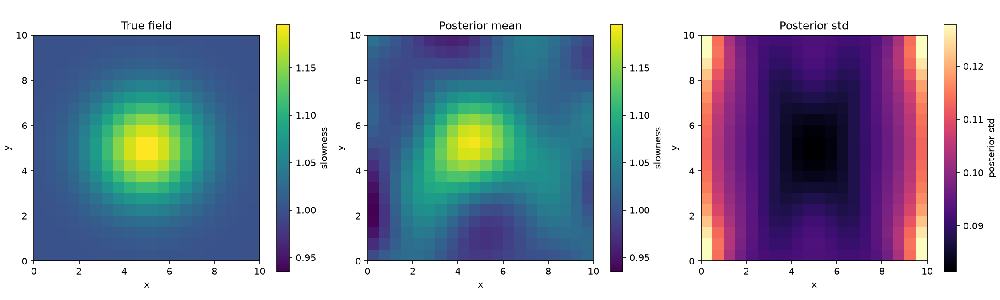

# Bayesian Linear Travel-Time Tomography

A small, reproducible computational study of a finite-dimensional Bayesian linear
inverse problem motivated by crosshole seismic travel-time tomography. The
slowness field is discretized on a uniform grid, travel times are modeled as
straight-ray line integrals, and the resulting linear-Gaussian posterior is
computed in closed form (no MCMC, no iterative optimization).

The full scientific specification — problem statement, prior/likelihood model,
and the five experiments (construction/validation, correctly-specified Bayesian
calibration, fixed-truth coverage, prior misspecification, noise
misspecification, acquisition-geometry sensitivity) — is in `experiment.pdf`.

See `ARCHITECTURE.md` for the module dependency structure and the key
distinction between the two senses of "calibrated" used throughout this
project.

## Status

Under active development, following the build order in `CLAUDE.md`.
Implemented so far: `geometry.py`, `forward.py`, `prior.py`, `inversion.py`,
`diagnostics.py`, `config.py`; Experiment I (construction/validation) end-to-end
via `scripts/run_experiment.py configs/baseline.yaml --plot`; and Experiment II
(correctly specified Bayesian calibration) via
`scripts/run_experiment.py configs/calibration_correct.yaml --experiment correctly_specified`.



The `n=20`, `N=1000`, `seed=12345` run under `results/baselines/` (files
`experiment_II_baseline_n20_N1000_seed12345.{npz,yaml}`) is the validated,
frozen reference result for Experiment II — it should not be overwritten by a
run with a different seed or configuration without also updating this note.

## Development

```bash
pip install -e ".[dev]"
pytest
```
